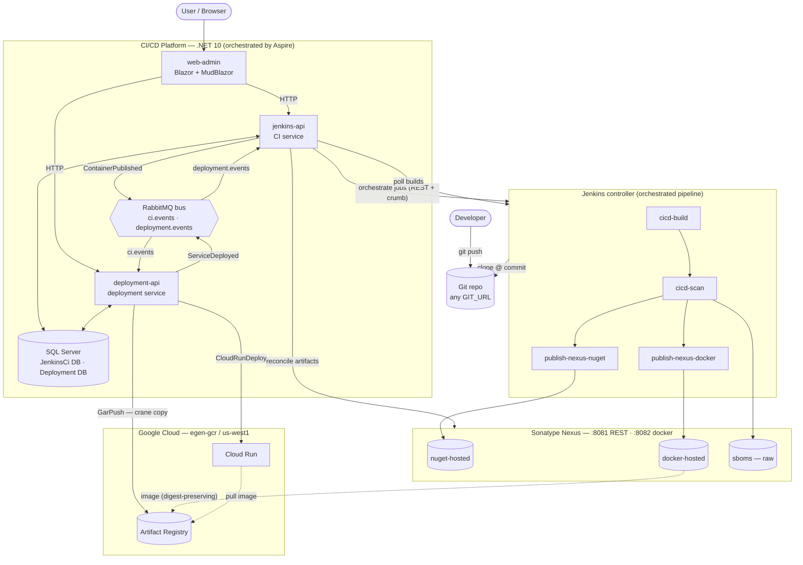
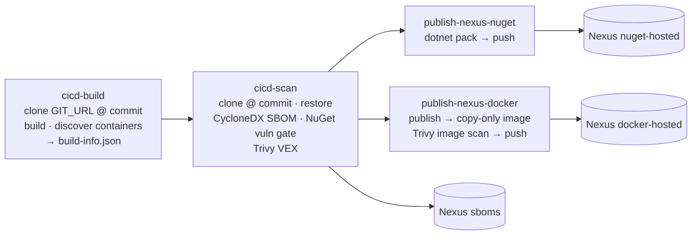
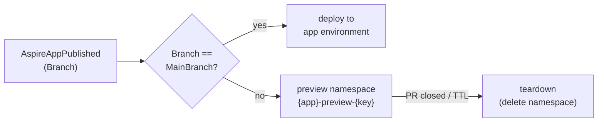

# Architecture

A repo‑agnostic CI/CD platform: Jenkins builds **any** Git repo, publishes artifacts to
Sonatype Nexus, and an event‑driven deployment service promotes containers to Google Cloud
(Artifact Registry → Cloud Run). The .NET services, SQL Server, and RabbitMQ are orchestrated
locally by **.NET Aspire** (`Cicd.Aspire.Host`); Jenkins and Nexus run as standalone containers.

Diagrams use [Mermaid](https://mermaid.js.org/) — they render in VS Code (Markdown Preview) and on GitHub.

## System overview



## CI/CD pipeline (build → scan → publish)

Each job is **repo‑agnostic**: `cicd-build` clones the caller‑supplied `GIT_URL`; the downstream
jobs clone the exact commit recorded in `build-info.json` (forwarded via `SOURCE_BUILD_NUMBER` +
the Copy Artifact plugin). Only apps (projects that opt in via `<Containerizable>`) produce
containers; libraries publish NuGet only. Containers are assembled by **copying publish output**
into a slim runtime image — never compiled inside the container.



`FAIL_ON_SEVERITY` gates the build at `cicd-scan` (dependency CVEs) and optionally at
`publish-nexus-docker` (image CVEs). SBOMs (`bom.json`, `vulnerabilities.json`, `bom-vex.json`)
land in Nexus keyed by package version and become the build's durable provenance.

## Event‑driven auto‑deploy

The CI service has no knowledge of deployment; it only publishes facts on the bus. The deployment
service reacts and promotes the image — automatically when a service's mapping has auto‑deploy on
(also triggerable manually from the UI).

```mermaid
sequenceDiagram
  participant CI as jenkins-api
  participant Bus as RabbitMQ
  participant Dep as deployment-api
  participant Nx as Nexus
  participant GAR as Artifact Registry
  participant Run as Cloud Run

  CI->>Nx: reconcile — find pushed container (by version / tag)
  CI->>Bus: ContainerPublished (ci.events)
  Bus->>Dep: deliver
  Dep->>Dep: upsert KnownContainer; match active service × auto mapping
  Dep->>Nx: GarPush — crane copy (digest-preserving)
  Nx-->>GAR: image
  Dep->>Run: CloudRunDeploy — create / update revision
  Run-->>GAR: pull image
  Dep->>Bus: ServiceDeployed (deployment.events)
  Bus->>CI: deliver
```

## Aspire → Kubernetes deploys

Alongside the per-service Cloud Run model, the deployment service deploys a **whole .NET Aspire app** to
Kubernetes via **Aspir8** (`aspirate`). CI publishes the app's Kustomize-output archive to Nexus; the
service fetches it, digest-pins the images, pins the target namespace, and applies. Each deploy is an
`AspireApplicationRun`; a Wolverine handler off `AspireApplicationRunRequested` shells out to
`aspirate apply`.

A set of **deploy-safety features** layer on that run lifecycle:

| Feature | Summary |
| --- | --- |
| **Deploy notifications** | Slack + email on every deploy outcome (`Deployment:Notifications`) |
| **Rollback** | Redeploy a previous succeeded run's digest-pinned manifest |
| **Promotion** | Deploy an app's current manifest to another environment (same artifacts) |
| **Approval gate** | Runs targeting a *protected* environment park as `AwaitingApproval` until approved |
| **Live-status & drift** | On-demand cluster health + undeployed-changes + image-drift (live vs. the run's snapshot) |
| **Preview environments** | Ephemeral per-PR/branch deploys into `{app}-preview-{key}` namespaces, with TTL + teardown |

**Namespace pinning:** the runner writes a top-level `namespace:` into the root kustomization and
ensures that namespace exists before applying, so each environment's namespace is honored and previews
are isolated.

**CI → preview handoff.** `AspireAppPublished` carries the build's `Branch`. The consumer routes on the
app's `MainBranch`: a publish on the main branch deploys to the app's environment; any other branch
creates/refreshes a preview keyed by that branch. A PR-close webhook (`/previews/webhook`) or the TTL
sweeper tears previews down.



Details: [deploy-safety-features.md](deployment/deploy-safety-features.md) ·
[preview-environments.md](deployment/preview-environments.md).

## Components

| Component | Tech | Responsibility |
| --- | --- | --- |
| **web-admin** (`cicd.web.admin`) | Blazor Server + MudBlazor | UI for Jenkins, Nexus, SCA/SBOM, CI (repos + pipelines), Deployment, Cloud. Typed `HttpClient`s to the two APIs (URLs injected by Aspire service discovery). |
| **jenkins-api** (CI service) | ASP.NET · Clean Arch · Wolverine · EF Core | Pipeline / PipelineRun aggregates; server‑side run executor drives Jenkins jobs; `JenkinsBuildSyncService` polls builds + reconciles artifacts from Nexus; raises `ContainerPublished`; CI→deployment handoff. |
| **deployment-api** (deployment service) | ASP.NET · Clean Arch · Wolverine · EF Core | Services × Environments × Mappings (typed steps `GarPush`, `CloudRunDeploy`), container inventory, deployment runs. Consumes `ci.events`; promotes Nexus→GAR (crane) and deploys Cloud Run (Google SDK / ADC). |
| **Jenkins controller** | Jenkins + pipeline jobs | Executes `cicd-build → cicd-scan → publish-nexus-{nuget,docker}` (Jenkinsfiles under `jenkins/`). Jobs run in a `netsdk10` build container (dotnet SDK + Trivy). |
| **Nexus** | Sonatype Nexus 3 | `nuget-hosted`, `docker-hosted` registry (`:8082`), `sboms` raw repo. REST on `:8081`. |
| **Messaging** | RabbitMQ + Wolverine (SQL outbox/inbox) | Fanout channels `ci.events` (CI facts) and `deployment.events` (deploy outcomes). |
| **Data** | SQL Server (Aspire data volume) | `JenkinsCi` and `Deployment` databases. |
| **Cloud target** | Google Artifact Registry + Cloud Run | Per‑environment GCP project/region (default `egen-gcr` / `us-west1`). Auth via ADC. |
| **Shared contracts** | `Cicd.IntegrationEvents` | Cross‑service events: `Ci.ContainerPublished`, `Ci.AspireAppPublished` (carries `Branch`), `Ci.PipelineCompleted/StepCompleted/Cancelled`, `Deployment.ServiceDeployed`, `Deployment.AspireApplicationDeployed`. |

## Where things live

| Concern | Path |
| --- | --- |
| Aspire host (orchestration) | `src/Aspire/Cicd.Aspire.Host` |
| Blazor UI | `src/web-admin/cicd.web.admin` |
| CI service (Clean Arch) | `src/jenkins/Jenkins.{Domain,Application,Infrastructure,Api,Client,Orchestrator}` |
| Deployment service (Clean Arch) | `src/deployment/Deployment.{Domain,Application,Infrastructure,Api,Contracts}` |
| Jenkinsfiles | `jenkins/{build,scan,publish/nexus/{nuget,docker},jobs}` |
| Default pipeline chain | `Jenkins.Application/.../ListPipelines.cs` (seed) · `Jenkins.Orchestrator/DefaultPipelines.cs` |
| Shared event contracts | `src/shared/Cicd.IntegrationEvents` |

## Key principles

- **Repo‑agnostic** — every Jenkins job clones the target repo itself; the platform builds any repo, not just this monorepo.
- **Commit‑pinned** — scan/publish clone the exact `gitCommitHash` from `build-info.json`, so artifacts reflect exactly what was built.
- **Copy‑not‑compile images** — apps are published on the agent and copied into a non‑root runtime image with a HEALTHCHECK; no SDK in the shipped image.
- **Event‑driven & decoupled** — CI publishes facts; deployment reacts. Neither calls the other directly; reliability comes from the SQL outbox/inbox.
- **Shift‑left security** — dependency SBOM + CVE gate in `cicd-scan`; image CVE scan at docker‑publish; SBOMs stored durably in Nexus and surfaced in the SCA/SBOM UI.
