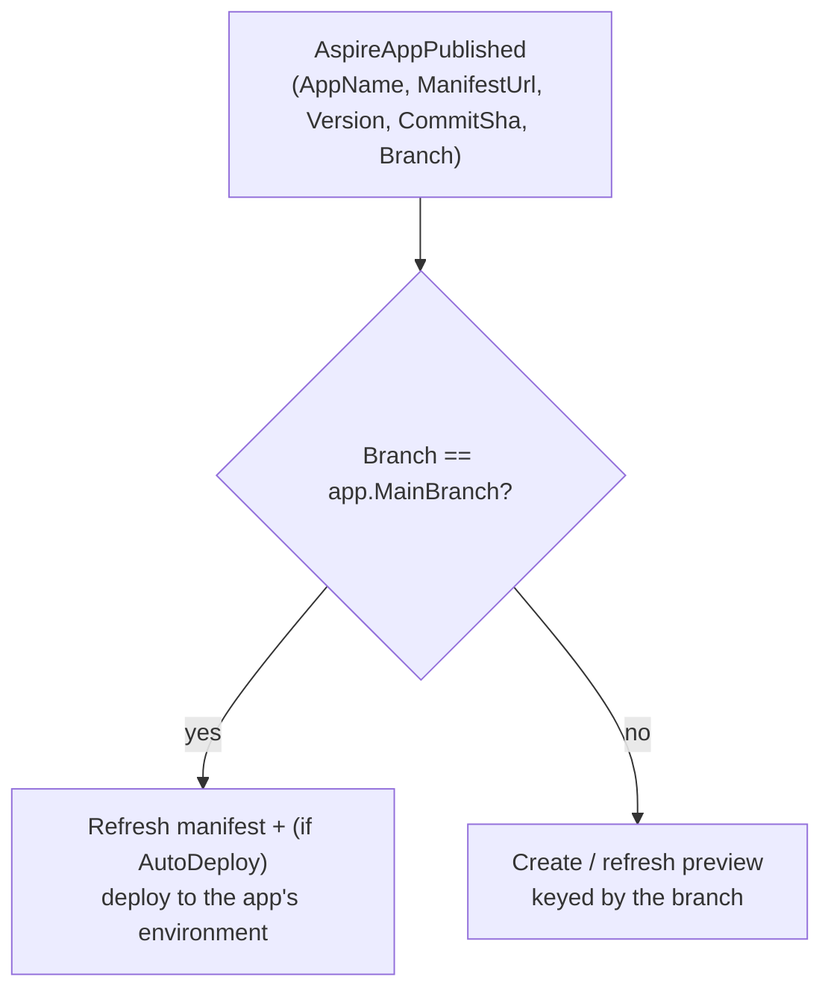
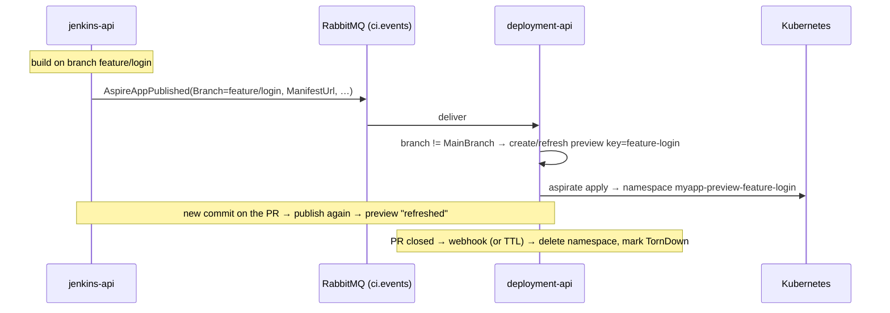

# Preview Environments & the CI PR Handoff

Ephemeral, isolated deploys of a .NET Aspire app — one per pull request or feature branch — with
automatic teardown. A preview is a whole-app deploy into its **own namespace**, tracked with a
lifecycle and reaped on close or expiry.

Diagrams use [Mermaid](https://mermaid.js.org/).

## Concept

A **preview environment** deploys an app's manifest into a derived namespace
`{app}-preview-{key}` (DNS-1123, ≤ 63 chars), where `key` is the PR number or branch. It reuses the
same Aspir8 runner as a normal deploy — the only difference is the target namespace and a lifecycle
record (`PreviewEnvironment`).

```
Creating ──deploy ok──▶ Active ──teardown / TTL──▶ TornDown
    │                                                  ▲
    └────────── deploy fails ──▶ Failed ───────────────┘  (teardown from any non-terminal state)
```

Two ways one is created:

1. **On-demand** — from web-admin (Deployment → Previews) or the API.
2. **CI-driven** — a build on a non-main branch publishes its manifest, and the deployment service
   auto-creates/refreshes a preview keyed by the branch.

## Branch routing (the CI handoff)

The CI service publishes `AspireAppPublished` on `ci.events` whenever an Aspire build's manifest lands
in Nexus. The event now carries the build's **`Branch`** (from `SourceRevision.Branch`). The deployment
consumer routes on it against the app's configured **`MainBranch`** (default `main`):



- **Main branch** → existing behavior: update `ManifestSource`/`Version`, and if `AutoDeploy` is on,
  deploy to the app's environment.
- **Any other branch** → create (or refresh) a preview keyed by that branch, using that build's manifest
  URL + version.
- An empty/unknown branch is treated as main (backward compatible).

Set `MainBranch` on the **Aspire app** create/edit form (web-admin), or via
`POST/PUT /api/deployment/aspire-apps`.

> **App resolution.** The consumer matches the publish to a registered app by its explicit
> `SourceKey` (falling back to name). The app must already exist — CI publishes never auto-create apps
> (their Kubernetes environment is a human choice).

## Lifecycle & refresh

A preview is **idempotent per app + key**:

- First publish/create on a branch → a new preview (`requested`).
- A later publish on the **same** branch with a **changed** manifest/version → the preview is redeployed
  in place and its TTL extended (`refreshed`).
- Same manifest again → no-op (`already-exists`).

TTL: previews get a time-to-live (default **24 h**; override with `ttlHours`). A background
**sweeper** (`Deployment:Previews:SweepIntervalMinutes`, default 15) tears down `Active` previews past
their expiry. Teardown deletes the namespace and marks the record `TornDown`; it's idempotent (a missing
namespace is success).

## API

| Method | Path | Purpose |
| --- | --- | --- |
| `GET` | `/api/deployment/previews?includeTornDown=false` | List previews |
| `GET` | `/api/deployment/previews/{id}` | One preview |
| `POST` | `/api/deployment/previews` | Create / refresh |
| `POST` | `/api/deployment/previews/{id}/teardown` | Tear down by id |
| `POST` | `/api/deployment/previews/webhook` | PR-lifecycle teardown (below) |

**Create / refresh** — `ManifestSource`/`Version` default to the app's current when omitted (pass a
branch build's manifest URL to preview that exact build):

```http
POST /api/deployment/previews
{
  "applicationId": "…",
  "key": "pr-42",                 // PR number or branch; slugified to DNS-1123
  "manifestSource": null,          // optional override
  "version": null,                 // optional override
  "ttlHours": 24,                  // optional (default 24)
  "triggeredBy": "ui"
}
→ { "previewId": "…", "namespace": "myapp-preview-pr-42", "outcome": "requested" }
```

`outcome` is one of `requested` (new), `refreshed` (redeployed in place), `already-exists` (no-op).

## Teardown webhook

A **normalized** PR-lifecycle hook so a git provider (or a Jenkins post-build step) can tear a preview
down when the PR closes/merges. The TTL sweeper is the fallback if it never fires.

```http
POST /api/deployment/previews/webhook
{
  "appName": "myapp",       // the app's CI source key or name (or use "applicationId")
  "key": "pr-42",           // branch / PR — slugified the same way as create
  "action": "closed"        // closed | merged | delete[d]  → teardown; anything else → no-op ack
}
→ { "applied": true, "outcome": "torn-down" }
```

Outcomes: `torn-down`, `already-torn-down`, `no-live-preview`, `app-not-found`,
`ignored-action:<action>`. **Always HTTP 200** — the body says what happened (webhooks expect 200).

This deployment endpoint tears a preview down but does not build anything — it's the teardown half. To
drive the **whole** loop (PR open → build → preview, PR close → teardown) from one place, use the
git ingress on jenkins-api below.

## Git ingress (jenkins-api) — the whole loop from one hook

`POST /api/jenkins/webhooks/git` is a first-class, **normalized** PR-lifecycle ingress on the CI
service. It routes by action:

- **opened / synchronize / reopened** → starts the repo's Aspire pipeline on the **PR branch**. That
  build publishes with its real branch (see below), so the deployment consumer stands up a preview.
- **closed / merged / deleted** → calls the deployment teardown (`/previews/webhook`) for the matching
  preview.

```http
POST /api/jenkins/webhooks/git
{
  "repository": "my-aspire-repo",   // the registered CI repository name (CI → Repositories)
  "branch": "feat/login",
  "action": "opened",               // opened|synchronize|reopened → build; closed|merged|deleted → teardown
  "prNumber": 42,                    // optional; used for the run's trigger label
  "appName": "myapp"                 // optional; deployment source key for teardown (defaults to repo name)
}
→ { "outcome": "build-triggered", "runId": "…" }   // or "teardown-requested", "default-branch-skipped", …
```

Previews are Aspire-only, so a non-Aspire repo is acknowledged as a no-op. The default branch is
skipped on open (that's a normal deploy, not a preview). **Always HTTP 200** — the body reports the
outcome.

### Wiring a real git provider

The ingress takes a *normalized* shape; provider payloads differ, so put a thin adapter in front (a
small function/route, or a webhook-relay) that maps the provider's PR event onto it:

| Provider | PR event | Map to (`POST /api/jenkins/webhooks/git`) |
| --- | --- | --- |
| GitHub | `pull_request` (`action`, `number`, `head.ref`) | `{ repository, branch: head.ref, action, prNumber: number }` |
| GitLab | Merge Request hook (`action`, `iid`, `source_branch`) | `{ repository, branch: source_branch, action, prNumber: iid }` |

The **branch** is the key: the CI build publishes with that branch, and both create and teardown
slug it the same way (`PreviewNaming.SlugKey`), so they resolve the same preview. Point the git
provider's webhook (or a relay) at jenkins-api; a public tunnel (e.g. ngrok) is needed for a cloud
provider to reach a local instance.

> **Branch plumbing.** For this to work, CI ingestion carries the real branch from `build-info.json`
> (`gitBranch`) into the build record, and pipeline runs inject `GIT_BRANCH` from the run's branch
> rather than always the repository default.

## End-to-end (CI-driven)



## Prerequisites

- The app must be **registered** with a Kubernetes environment (context + namespace).
- The cluster must be reachable from deployment-api (kubeconfig / context).
- Images must be pullable in the preview namespace — same registry as the base deploy. If the registry
  needs auth, enable `Deployment:Aspirate:EnsurePullSecret` so the pull secret is provisioned per
  namespace.

## Related

- [deploy-safety-features.md](deploy-safety-features.md) — the deploy path, live-status, namespace pinning.
- [aspire-k8s-local-runbook.md](aspire-k8s-local-runbook.md) — local docker-desktop cluster setup.
